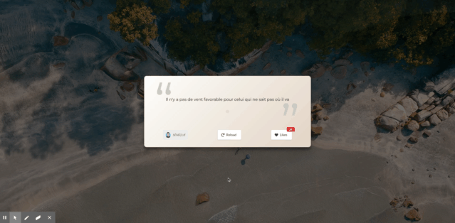

# InspiQuotes

[](https://app.netlify.com/sites/inspiquotes/deploys)



---

[Click Here to view more](https://inspiquotes.netlify.app)

---

### Création d'une page affichant différentes citations inspirantes

* Affichage d'une box contenant :

    - Citations
    - Auteur
    - Bouton "reload" (permet le chargement d'une nouvelle citation)
    - Bouton "like" (permet d'afficher le nombre de like d'une citation, et d'ajouter un like)

* Utilisation de **JQuery, Ajax**

* Utilisation du Framework CSS **[Semantic-UI](https://semantic-ui.com)**

* Utilisation d'un fichier de Data ``` quotes.json ``` : 
```
Exemple :
[
  {
    "id": 1,
    "text": "Change your life, learn to code",
    "author": "Unknown",
    "likes": 42
  }
]
```

* Utilisation de plugin de JQuery **[Backstretch](https://www.jquery-backstretch.com)** permettant le changement d'image en background toutes les x secondes : 
```
randomBackground: function() {
    let base = 'img/';
    $("#bg").backstretch([`${base}bg.jpg`, `${base}bg1.jpg`, `${base}bg2.jpg`, `${base}bg3.jpg`, `${base}bg4.jpg`], {duration: 5000, fade:1500});
  }, 
```

---

Le reste est *fait main*, n'hésitez à cloner et regarder
